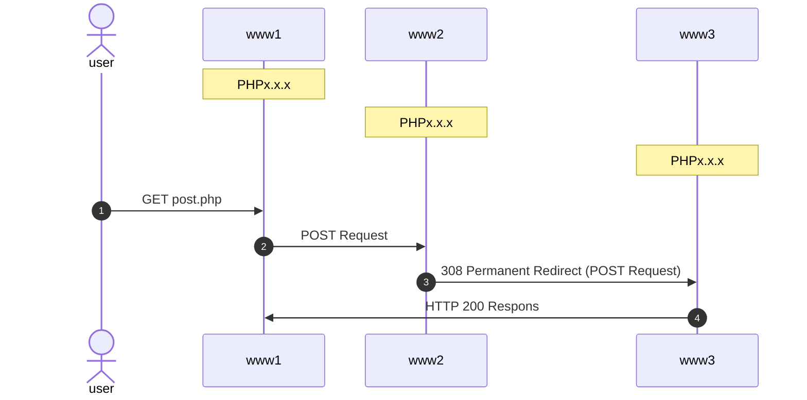

# 308 Permanent Redirect file_get_contents 検証

## これは何

PHP の file_get_contents 関数を利用した POST 送信を 308 リダイレクトすると POST ではなく GET になる事象を検証するリポジトリ

## システム構成

| サービス | 役割                                                            |
| -------- | --------------------------------------------------------------- |
| www1     | 呼び出し元となるサービス。www3 からのレスポンスを画面に表示する |
| www2     | リクエストを www3 に向けて 308 リダイレクトを実行するサービス   |
| www3     | リクエスト内容を出力するサービス                                |

## フロー図



## ディレクトリ構成

```sh
├── .env
├── docker-compose.yml
├── memo.md
├── README.md
├── www1
│  ├── get.php
│  ├── index.php
│  └── post.php
├── www1.conf
├── www2
│  ├── index.php
│  └── redirect
│     └── dump.php
├── www2.conf
├── www3
│  ├── index.php
│  └── redirect
│     └── dump.php
└── www3.conf
```

## 提供 URL

| サービス | URL                                     | 役割                                                                                                         |
| -------- | --------------------------------------- | ------------------------------------------------------------------------------------------------------------ |
| www1     | http://localhost:8081/index.php         | www1 の phpinfo() を出力する                                                                                 |
| www1     | http://localhost:8081/get.php           | GET リクエストの 308 リダイレクト検証用                                                                      |
| www1     | http://localhost:8081/post.php          | POST リクエストの 308 リダイレクト検証用                                                                     |
| www2     | http://localhost:8082/index.php         | www2 の phpinfo() を出力する                                                                                 |
| www2     | http://localhost:8082/redirect/dump.php | www3 の リクエスト情報を dump するエンドポイントだが、www3 へ 308 リダイレクトするので直接アクセスは出来ない |
| www3     | http://localhost:8083/index.php         | www3 の phpinfo() を出力する                                                                                 |
| www3     | http://localhost:8083/redirect/dump.php | www3 の リクエスト情報を dump するエンドポイント                                                             |

## 使い方

### PHP バージョンを指定する

`.env` ファイルにて各サービスの PHP バージョンを指定する

```.env
PHP1=8.2.7-fpm
PHP2=8.2.6-fpm
PHP3=8.2.6-fpm
```

### コンテナを起動する

```sh
docker compose up -d
```

### www1 の検証 URL にアクセスする

ブラウザで以下 URL にアクセスする

http://localhost:8081/post.php

### コンテナを終了する

```sh
docker compose down
```

## 出力内容

以下に記載する PHP のグローバル変数の内容を出力します

- `$_REQUEST`
- `$_SERVER`
- `$_GET`
- `$_POST`

出力される値は www3 の値になります

```
string(77842) "www3

$_REQUEST
array(2) { ["say"]=> string(2) "Hi" ["to"]=> string(3) "Mom" }

$_SERVER
array(44) { ["HOSTNAME"]=> string(12) "c0176d88d50a" ["PHP_INI_DIR"]=> string(18) "/usr/local/etc/php" ["HOME"]=> string(8) "/var/www" ["PHP_LDFLAGS"]=> string(12) "-Wl,-O1 -pie" ["PHP_CFLAGS"]=> string(83) "-fstack-protector-strong -fpic -fpie -O2 -D_LARGEFILE_SOURCE -D_FILE_OFFSET_BITS=64" ["PHP_VERSION"]=> string(5) "8.2.6" ["GPG_KEYS"]=> string(122) "39B641343D8C104B2B146DC3F9C39DC0B9698544 E60913E4DF209907D8E30D96659A97C9CF2A795A 1198C0117593497A5EC5C199286AF1F9897469DC" ["PHP_CPPFLAGS"]=> string(83) "-fstack-protector-strong -fpic -fpie -O2 -D_LARGEFILE_SOURCE -D_FILE_OFFSET_BITS=64" ["PHP_ASC_URL"]=> string(54) "https://www.php.net/distributions/php-8.2.6.tar.xz.asc" ["PHP_URL"]=> string(50) "https://www.php.net/distributions/php-8.2.6.tar.xz" ["PATH"]=> string(60) "/usr/local/sbin:/usr/local/bin:/usr/sbin:/usr/bin:/sbin:/bin" ["PHPIZE_DEPS"]=> string(76) "autoconf dpkg-dev file g++ gcc libc-dev make pkg-config re2c" ["PWD"]=> string(13) "/var/www/html" ["PHP_SHA256"]=> string(64) "10b796f0ed45574229851212b30a596a76e70ae365322bcaaaf9c00fa7d58cca" ["USER"]=> string(8) "www-data" ["HTTP_CONTENT_LENGTH"]=> string(2) "13" ["HTTP_CONTENT_TYPE"]=> string(33) "application/x-www-form-urlencoded" ["HTTP_CONNECTION"]=> string(5) "close" ["HTTP_HOST"]=> string(6) "nginx3" ["REDIRECT_STATUS"]=> string(3) "200" ["SERVER_NAME"]=> string(0) "" ["SERVER_PORT"]=> string(2) "80" ["SERVER_ADDR"]=> string(10) "172.29.0.3" ["REMOTE_PORT"]=> string(5) "39162" ["REMOTE_ADDR"]=> string(10) "172.29.0.6" ["SERVER_SOFTWARE"]=> string(12) "nginx/1.25.0" ["GATEWAY_INTERFACE"]=> string(7) "CGI/1.1" ["REQUEST_SCHEME"]=> string(4) "http" ["SERVER_PROTOCOL"]=> string(8) "HTTP/1.1" ["DOCUMENT_ROOT"]=> string(15) "/etc/nginx/html" ["DOCUMENT_URI"]=> string(18) "/redirect/dump.php" ["REQUEST_URI"]=> string(18) "/redirect/dump.php" ["SCRIPT_NAME"]=> string(18) "/redirect/dump.php" ["CONTENT_LENGTH"]=> string(2) "13" ["CONTENT_TYPE"]=> string(33) "application/x-www-form-urlencoded" ["REQUEST_METHOD"]=> string(4) "POST" ["QUERY_STRING"]=> string(0) "" ["SCRIPT_FILENAME"]=> string(32) "/var/www/html//redirect/dump.php" ["FCGI_ROLE"]=> string(9) "RESPONDER" ["PHP_SELF"]=> string(18) "/redirect/dump.php" ["REQUEST_TIME_FLOAT"]=> float(1698757715.378306) ["REQUEST_TIME"]=> int(1698757715) ["argv"]=> array(0) { } ["argc"]=> int(0) }

$_GET
array(0) { }

$_POST
array(2) { ["say"]=> string(2) "Hi" ["to"]=> string(3) "Mom" }
```
