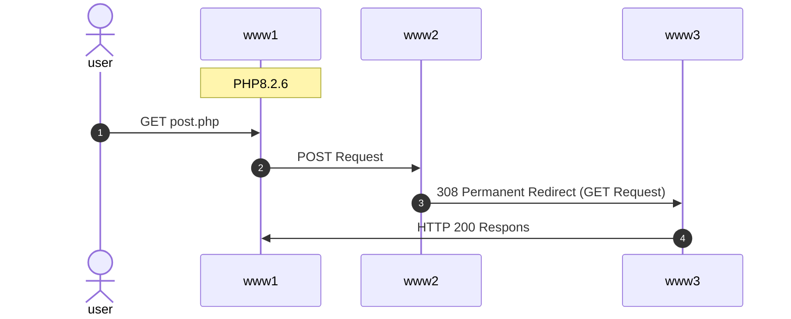

# 308 Permanent Redirect file_get_contents 検証

## 前提

www2, www3 の PHP バージョンは問わない

## www1 の PHP が 8.2.7


### 結果

www3 に POST のリクエスト可能

### ログ

#### www1

##### nginx

```sh
2023-10-31 21:57:22 192.168.65.1 - - [31/Oct/2023:12:57:22 +0000] "GET /post.php HTTP/1.1" 200 75427 "-" "Mozilla/5.0 (Macintosh; Intel Mac OS X 10_15_7) AppleWebKit/537.36 (KHTML, like Gecko) Chrome/118.0.0.0 Safari/537.36"
```

##### php

```sh
2023-10-31 21:57:22 172.25.0.7 - 31/Oct/2023:12:57:22 +0000 "GET /post.php" 200
```

#### www2

##### nginx

```sh
2023-10-31 21:57:22 172.25.0.6 - - [31/Oct/2023:12:57:22 +0000] "POST /redirect/dump.php HTTP/1.1" 308 171 "-" "-"
```

##### php

ログなし

#### www3

##### nginx

```sh
2023-10-31 21:57:22 172.25.0.6 - - [31/Oct/2023:12:57:22 +0000] "POST /redirect/dump.php HTTP/1.1" 200 75400 "-" "-"
```

##### php

```sh
2023-10-31 21:57:22 172.25.0.3 - 31/Oct/2023:12:57:22 +0000 "POST /redirect/dump.php" 200
```

## www1 の PHP が 8.2.6



### 結果

www3 に POST のリクエスト不可能

### ログ

#### www1

##### nginx

```sh
2023-10-31 22:03:06 192.168.65.1 - - [31/Oct/2023:13:03:06 +0000] "GET /post.php HTTP/1.1" 200 74508 "-" "Mozilla/5.0 (Macintosh; Intel Mac OS X 10_15_7) AppleWebKit/537.36 (KHTML, like Gecko) Chrome/118.0.0.0 Safari/537.36"
```

##### php

```sh
2023-10-31 22:03:06 172.27.0.7 - 31/Oct/2023:13:03:06 +0000 "GET /post.php" 200
```

#### www2

##### nginx

```sh
2023-10-31 22:03:06 172.27.0.6 - - [31/Oct/2023:13:03:06 +0000] "POST /redirect/dump.php HTTP/1.1" 308 171 "-" "-"
```

##### php

ログなし

#### www3

##### nginx

```sh
2023-10-31 22:03:06 172.27.0.6 - - [31/Oct/2023:13:03:06 +0000] "GET /redirect/dump.php HTTP/1.1" 200 74481 "-" "-"
```

##### php

```sh
2023-10-31 22:03:06 172.27.0.3 - 31/Oct/2023:13:03:06 +0000 "GET /redirect/dump.php" 200
```

## www1 の PHP が 7.4.33


### 結果

www3 に POST のリクエスト不可能

### ログ

#### www1

##### nginx

```sh
2023-10-31 22:01:01 192.168.65.1 - - [31/Oct/2023:13:01:01 +0000] "GET /post.php HTTP/1.1" 200 74508 "-" "Mozilla/5.0 (Macintosh; Intel Mac OS X 10_15_7) AppleWebKit/537.36 (KHTML, like Gecko) Chrome/118.0.0.0 Safari/537.36"
```

##### php

```sh
2023-10-31 22:01:01 172.26.0.7 - 31/Oct/2023:13:01:01 +0000 "GET /post.php" 200
```

#### www2

##### nginx

```sh
2023-10-31 22:01:01 172.26.0.6 - - [31/Oct/2023:13:01:01 +0000] "POST /redirect/dump.php HTTP/1.0" 308 171 "-" "-"
```

##### php

ログなし

#### www3

##### nginx

```sh
2023-10-31 22:01:01 172.26.0.6 - - [31/Oct/2023:13:01:01 +0000] "GET /redirect/dump.php HTTP/1.0" 200 74389 "-" "-"
```

##### php

```sh
2023-10-31 22:01:01 172.26.0.3 - 31/Oct/2023:13:01:01 +0000 "GET /redirect/dump.php" 200
```
